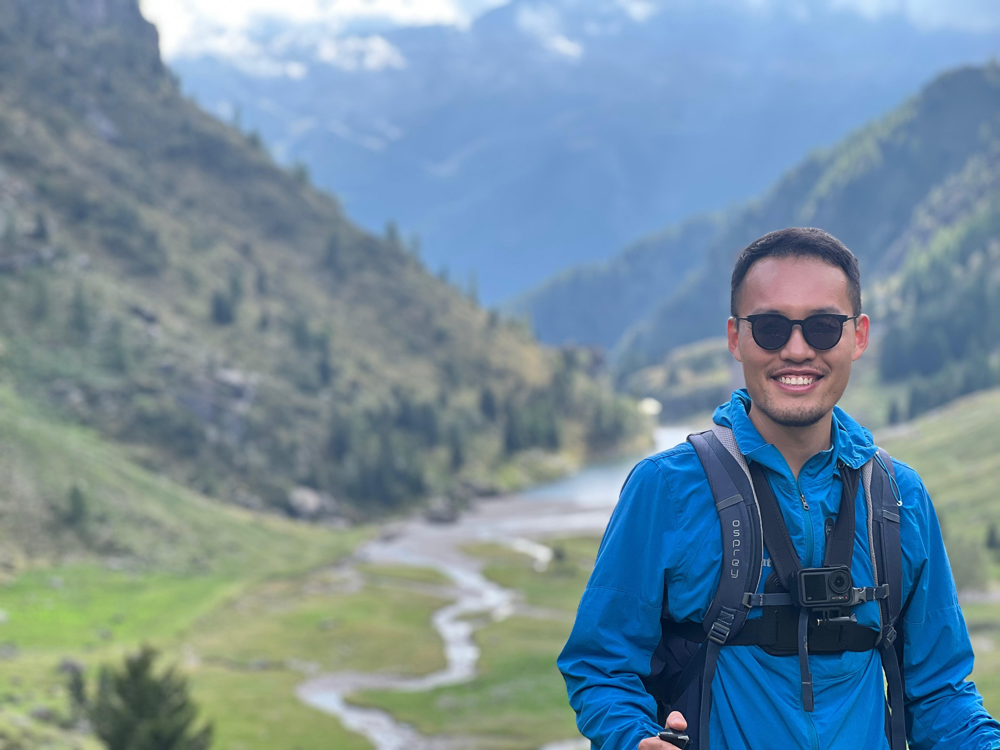
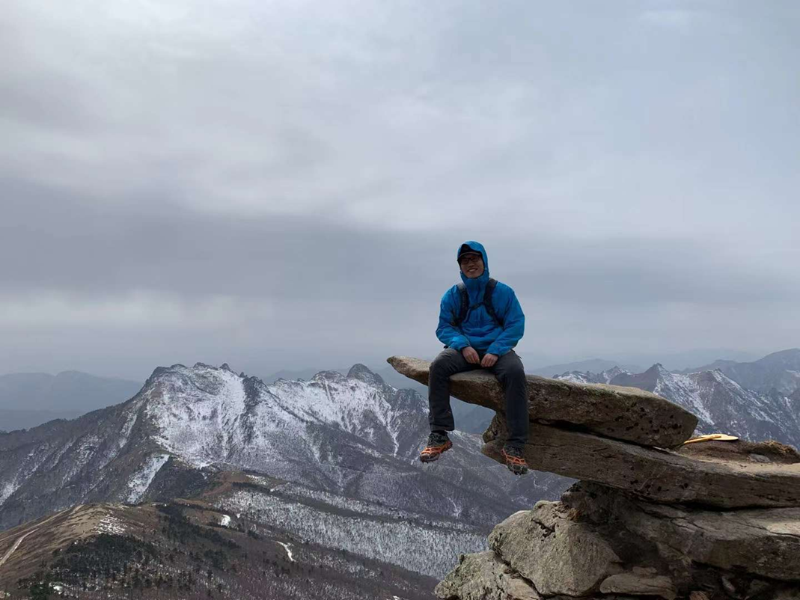

<figure style="margin:0 0 1.25rem 0;">
  
  <figcaption style="font-size:0.95rem; opacity:0.9; margin-top:0.45rem;">Valle di Scalve, northern Province of Bergamo, Italy.</figcaption>
</figure>

<figure style="margin:0;">
  
  <figcaption style="font-size:0.95rem; opacity:0.9; margin-top:0.45rem;">Guangtou Mountain, west side of the Qinling watershed inside Fengyukou, China.</figcaption>
</figure>
