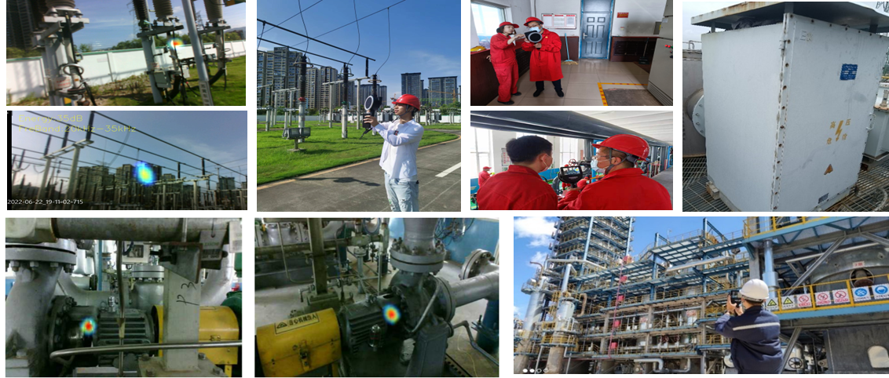

## Context and Objective

This project focused on building an industrial-grade acoustic camera pipeline spanning array design, signal processing, hardware-aware implementation, and field validation.  
During the startup phase, I led core algorithm R&D and system engineering deployment, building a measurable and deployable technical path from acoustic theory to real-world operation.

## My Contributions

- Designed microphone arrays for different application scenarios and conducted performance simulations  
- Designed algorithm architecture and collaborated with embedded teams on implementation and iteration  
- Drove FPGA-oriented fixed-point verification to bridge offline models and real-time execution

## Technical Approach

### 1) Array Design and Acoustic Simulation

Under mechanical constraints imposed by infrared and optical camera modules, I designed and simulated a **128-element spiral microphone array**.  
Based on sound-field modeling and beampattern analysis, the new geometry improved main-lobe-to-side-lobe suppression by approximately **1.0-4.4 dB**, increasing interference robustness.

  <figure style="margin:0;">
    
    <figcaption style="font-size:0.9rem; opacity:0.85;">Figure 1. Layout design of the 128-element array.</figcaption>
  </figure>
  <figure style="margin:0;">
    
    <figcaption style="font-size:0.9rem; opacity:0.85;">Figure 2. Beampattern comparison and interference evaluation.</figcaption>
  </figure>
  <figure style="margin:0;">
    
    <figcaption style="font-size:0.9rem; opacity:0.85;">Figure 3. Beamforming simulation with main-lobe and side-lobe characteristics.</figcaption>
  </figure>

### 2) Multimodal Signal Processing and PRPD Analysis

I built an audio-visual geometric calibration and multi-band detection workflow.  
For partial-discharge scenarios, I optimized PRPD processing with power-frequency information and generated phi-q maps and phi-energy maps for discharge-type discrimination.  
I also improved weak-signal localization stability through 64-channel enhancement, thresholding strategies, and band-pass filtering.

  <figure style="flex:1; min-width:260px; margin:0;">
    
    <figcaption style="font-size:0.9rem; opacity:0.85;">Figure 4. PRPD maps for key discharge-pattern analysis.</figcaption>
  </figure>
  <figure style="flex:1; min-width:260px; margin:0;">
    
    <figcaption style="font-size:0.9rem; opacity:0.85;">Figure 5. Time-frequency and recognition results after multichannel enhancement.</figcaption>
  </figure>

### 3) Hardware-Aware Optimization

For FPGA deployment, I carried out fixed-point simulation and quantization-error analysis.  
To meet different hardware constraints on compute, on-chip memory, bandwidth, and power, I applied tiered optimization strategies to the localization pipeline: preserving richer frequency-domain features and multichannel fusion on high-performance platforms, while using a lightweight flow and key-parameter pruning on edge platforms to keep output stable and latency controllable.  
I also established a consistency-evaluation workflow from floating-point models to fixed-point implementation, analyzed error sources module by module, and iteratively refined quantization strategies to provide reliable support for real-time engineering deployment.

## Deployment and Validation

System validation was performed not only in controlled laboratory settings, but also in representative field scenarios including UAV-mounted measurements, anechoic-chamber experiments, and power-grid environments.

- **UAV-mounted tests**: With acoustic shielding to suppress rotor noise, the system could stably identify target acoustic signatures.  
- **High-voltage field tests**: We performed onsite analysis of noise and discharge signals, continuously collected real engineering data, and iterated the algorithms.  
- **Anechoic-chamber tests**: We calibrated and compared representative discharge modes such as suspended discharge and tip discharge.

  <figure style="flex:1; min-width:260px; margin:0;">
    
    <figcaption style="font-size:0.9rem; opacity:0.85;">Figure 6. System calibration and validation in an anechoic chamber.</figcaption>
  </figure>
  <figure style="flex:1; min-width:260px; margin:0;">
    
    <figcaption style="font-size:0.9rem; opacity:0.85;">Figure 7. Field data acquisition in a gas-leakage detection scenario.</figcaption>
  </figure>

### 4) Application Scenarios

<figure style="margin:1rem 0 0 0;">
  
  <figcaption style="font-size:0.9rem; opacity:0.85;">Figure 8. Practical application scenarios of the acoustic camera system in industrial environments.</figcaption>
</figure>

## Related Patent

- [A method for detecting pipeline gas leakage (CN117515432A)](https://patents.google.com/patent/CN117515432A/en?oq=CN117515432A)
