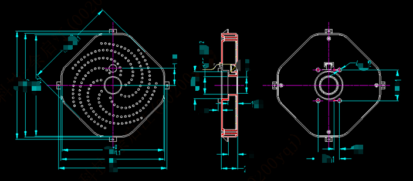
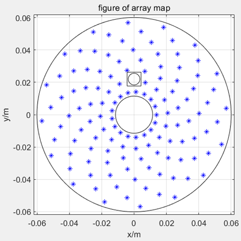
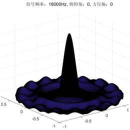
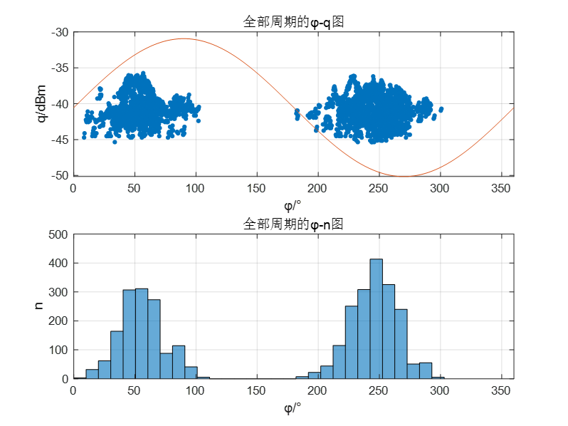
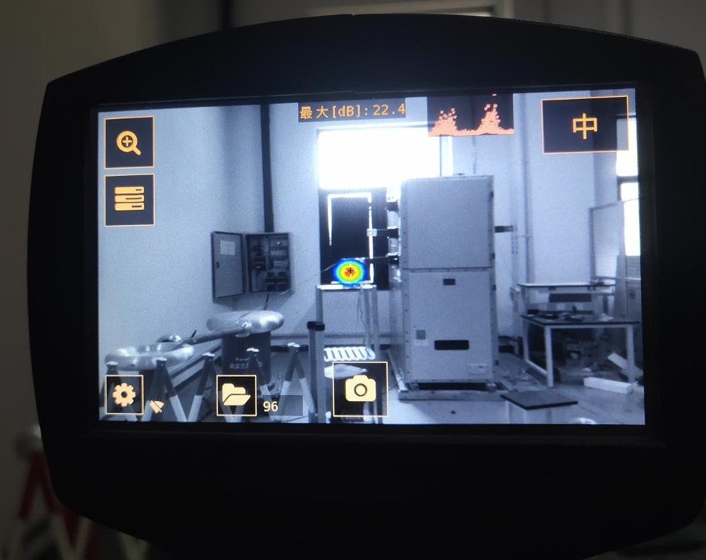
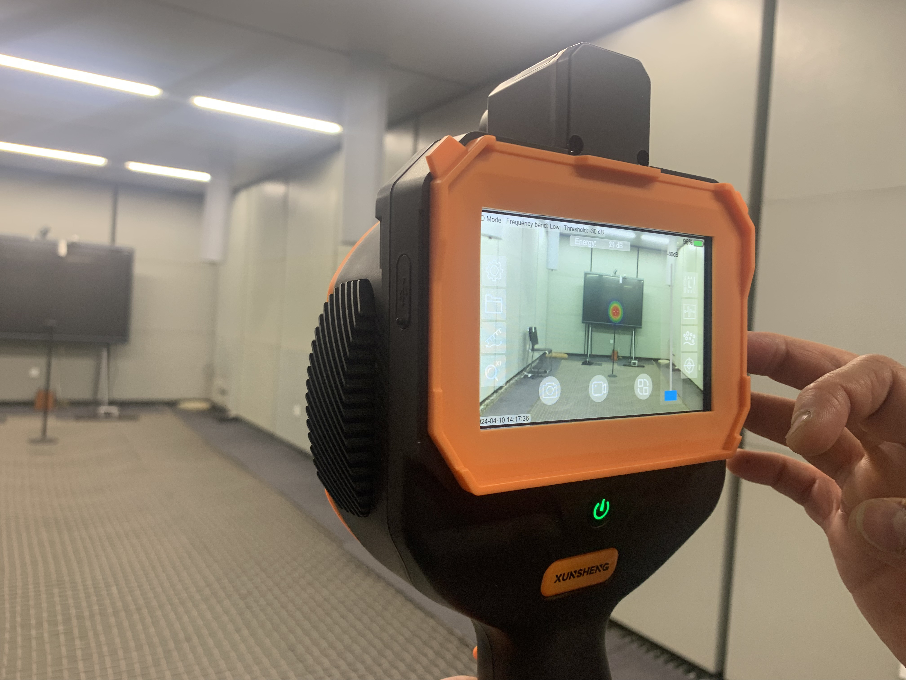

## Context and Objective

This project focused on building an industrial-grade acoustic camera pipeline, spanning array design, signal processing, hardware-aware implementation, and field validation.  
During my work at Xi'an Lianfeng Xunsheng Information Technology, I led core algorithm development and system engineering for practical deployment.

In one sentence: I built a measurable and deployable technical path from acoustic theory to real-world operation.

## My Contributions

- Designed algorithm architecture and coordinated with embedded teams for implementation and iteration  
- Drove FPGA-oriented fixed-point validation to bridge offline models and real-time execution

## Technical Approach

### 1) Array Design and Acoustic Simulation

Under mechanical constraints from infrared and camera modules, I designed and simulated a **128-element spiral microphone array**.  
Based on sound-field modeling and beampattern analysis, the new geometry improved main-lobe-to-side-lobe suppression by approximately **1.0-4.4 dB**, increasing interference robustness.

  <figure style="flex:1; min-width:260px; margin:0;">
    
    <figcaption style="font-size:0.9rem; opacity:0.85;">Figure 1. Layout design of the 128-element array.</figcaption>
  </figure>
  <figure style="flex:1; min-width:260px; margin:0;">
    
    <figcaption style="font-size:0.9rem; opacity:0.85;">Figure 2. Beampattern comparison and interference evaluation.</figcaption>
  </figure>

<figure style="margin:1rem 0 0 0;">
  
  <figcaption style="font-size:0.9rem; opacity:0.85;">Figure 3. Beamforming simulation with main-lobe and side-lobe characteristics.</figcaption>
</figure>

### 2) Multimodal Signal Processing and PRPD Analysis

I built an audio-visual geometric calibration and multi-band detection workflow.  
For partial-discharge scenarios, I optimized PRPD processing with power-frequency information and generated \(\phi\)-\(q\) and \(\phi\)-energy maps for discharge type discrimination.  
I also improved weak-signal localization stability through 64-channel enhancement, thresholding strategies, and band-pass filtering.

  <figure style="flex:1; min-width:260px; margin:0;">
    
    <figcaption style="font-size:0.9rem; opacity:0.85;">Figure 4. PRPD maps for key discharge-pattern analysis.</figcaption>
  </figure>
  <figure style="flex:1; min-width:260px; margin:0;">
    
    <figcaption style="font-size:0.9rem; opacity:0.85;">Figure 5. Time-frequency and recognition results after multichannel enhancement.</figcaption>
  </figure>

### 3) Hardware-Aware Optimization

I conducted fixed-point simulation and quantization-error analysis for FPGA deployment.  
Results showed that 16-bit sampling can satisfy small-signal localization needs under system conditions of 120 dB AOP and approximately 64.3 dB SNR, providing quantitative evidence for real-time implementation.

## Deployment and Validation

Validation was performed not only in controlled laboratory settings, but also in challenging field conditions including UAV-mounted measurements, anechoic chamber experiments, and power-grid environments.

- **UAV-mounted tests**: With acoustic shielding for rotor-noise suppression, clear discharge peaks remained observable at around 5 m.  
- **High-voltage field tests**: Conducted noise and discharge analysis at 20-30 m and beyond to collect real engineering data.  
- **Anechoic chamber tests**: Calibrated and compared representative discharge modes such as suspended and tip discharge.

  <figure style="flex:1; min-width:260px; margin:0;">
    
    <figcaption style="font-size:0.9rem; opacity:0.85;">Figure 6. System calibration and validation in an anechoic chamber.</figcaption>
  </figure>
  <figure style="flex:1; min-width:260px; margin:0;">
    
    <figcaption style="font-size:0.9rem; opacity:0.85;">Figure 7. Field data acquisition under complex operating conditions.</figcaption>
  </figure>

## Research-Oriented Value

This project demonstrates a complete competence loop from theory and algorithm design to hardware implementation and field validation.  
It highlights transferable strengths in array acoustics, robust signal processing, hardware-aware optimization, and evidence-driven engineering under real constraints.

## Related Patent

- [A method for detecting pipeline gas leakage (CN117515432A)](https://patents.google.com/patent/CN117515432A/en?oq=CN117515432A)
