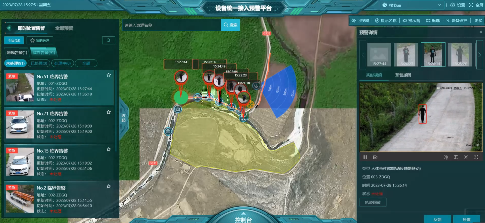
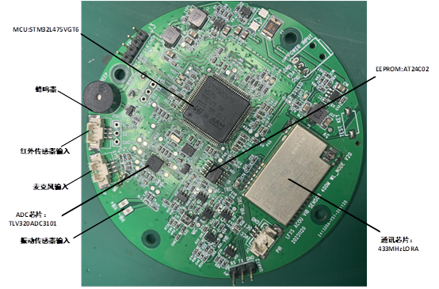
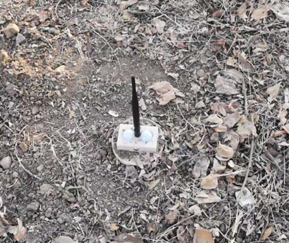

## Context and Objective

This project targeted unattended perimeter monitoring under strict constraints on power, computation, and wireless reliability.  
I deployed an AI detection model on STM32 chips and achieved efficient target detection performance.  
The objective was to build a deployable edge-intelligence pipeline that remains stable during long-duration field operation.

## My Contributions

- Designed frequency-domain features and a lightweight model architecture for resource-constrained MCUs  
- Implemented embedded firmware for acquisition, inference triggering, communication, and power-state transitions  
- Designed a multi-node communication protocol to support inter-node collaboration and reliable platform-side reporting  
- Built an integrated validation workflow from node-level performance to multi-node field operation

## Technical Approach

### 1) Edge Feature and Model Design

At the feature level, I built a time-frequency representation based on short-time spectral energy distribution to improve sensitivity to target behavior, and used normalization and windowing strategies to increase robustness in complex environments.  
At the model level, I adopted a compact `Conv -> ReLU -> MaxPool -> FC` structure to balance detection accuracy and computational efficiency on STM32, meeting real-time edge execution requirements.

### 2) Low-Power Embedded Execution

On the embedded side, I implemented continuous ADC sampling, DMA-based data transfer, and interrupt-driven wake-up control.  
The state-machine firmware design reduced idle overhead and enabled long-term unattended operation while preserving event responsiveness.

## Deployment and Validation

| Metric | Result | Engineering Implication |
| --- | --- | --- |
| Edge Inference | 128-point STFT + lightweight CNN | Feasible real-time inference on constrained MCU resources |
| Detection Quality | Walk recall > 90% at 12-24 m | Reliable perception in outdoor conditions |
| Power Behavior | Long unattended runtime | State-machine control lowers average consumption |
| System-Level Operation | Real-time node-to-platform reporting | Supports scalable multi-node deployment |

### Interface and Runtime Monitoring

*Figure 1. End-to-end workflow from on-device inference to event reporting and status monitoring.*

### Embedded Hardware Platform

*Figure 2. Hardware integration of MCU, wireless module, and sensing interfaces for low-power operation.*

### Field Deployment

*Figure 3. Multi-node outdoor deployment used for long-duration validation and robustness testing.*

## Related Patent

- [Wireless low-power consumption ground defense monitoring devices (CN218511891U)](https://patents.google.com/patent/CN218511891U/en?oq=CN218511891U)
