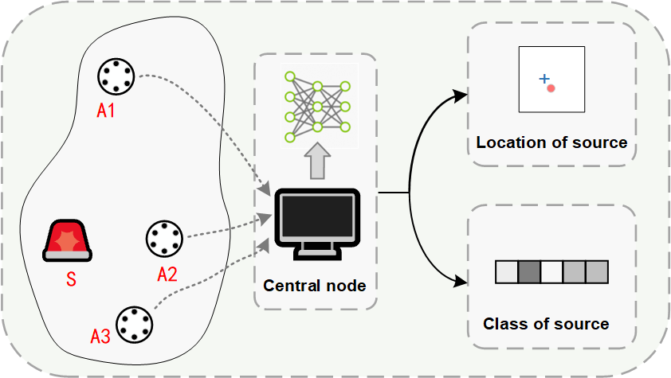
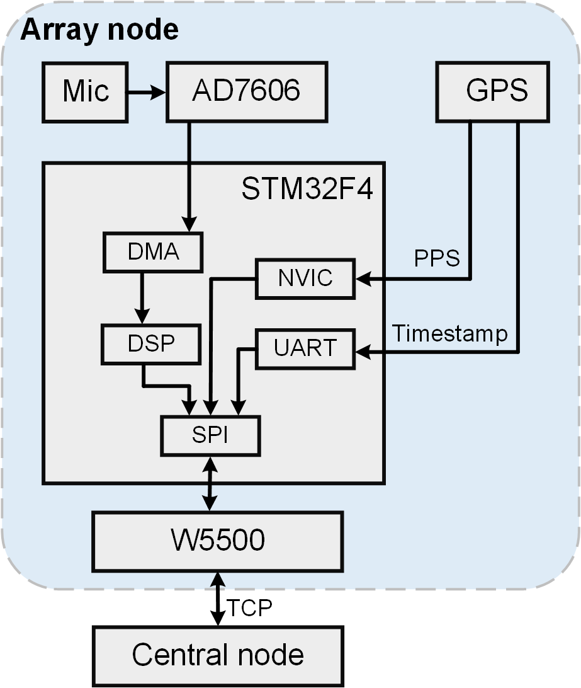
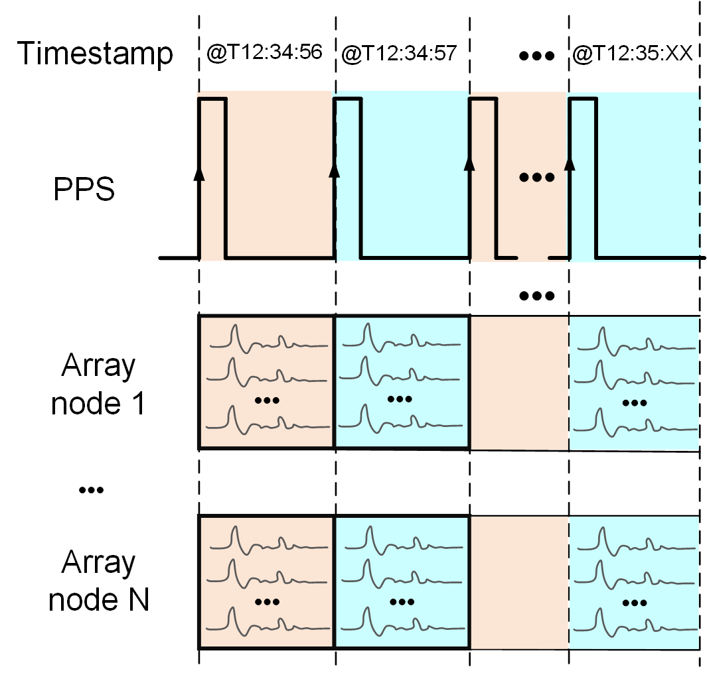
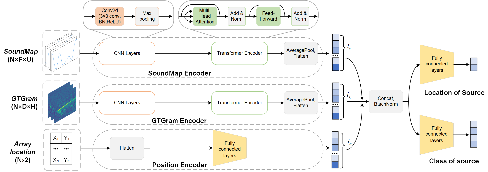
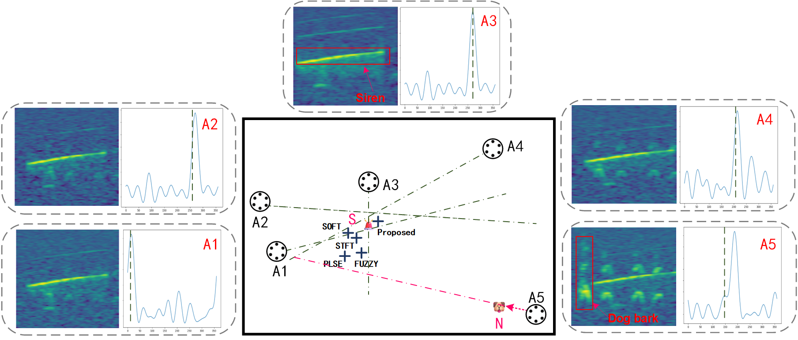
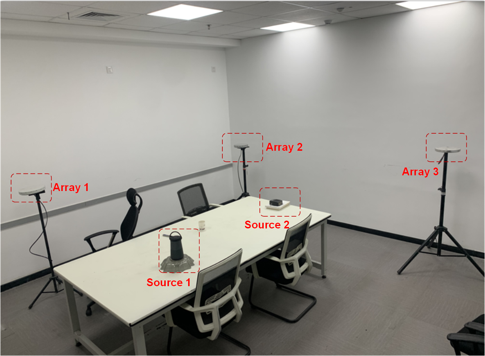
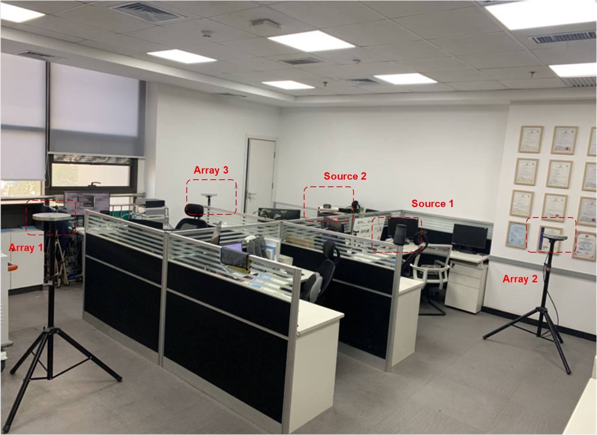
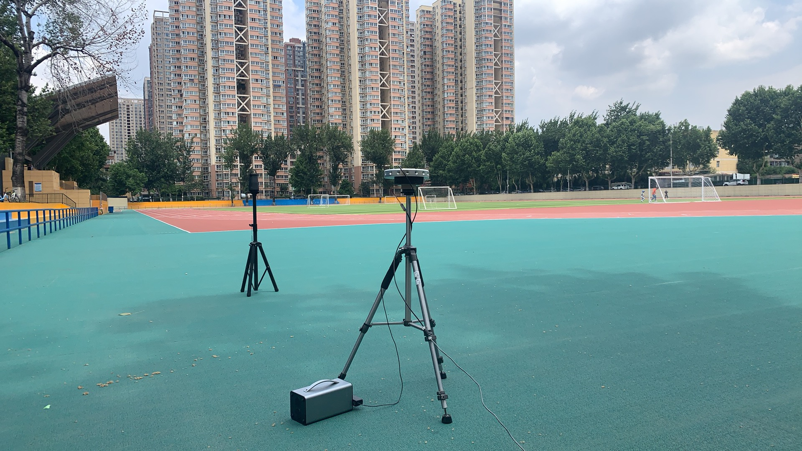
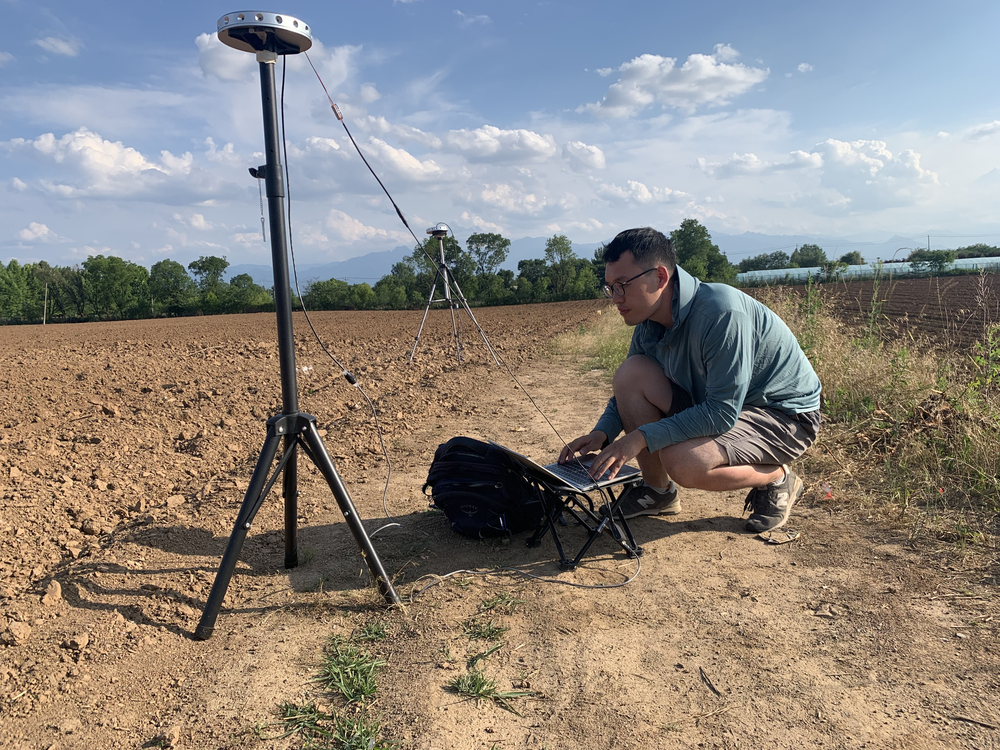
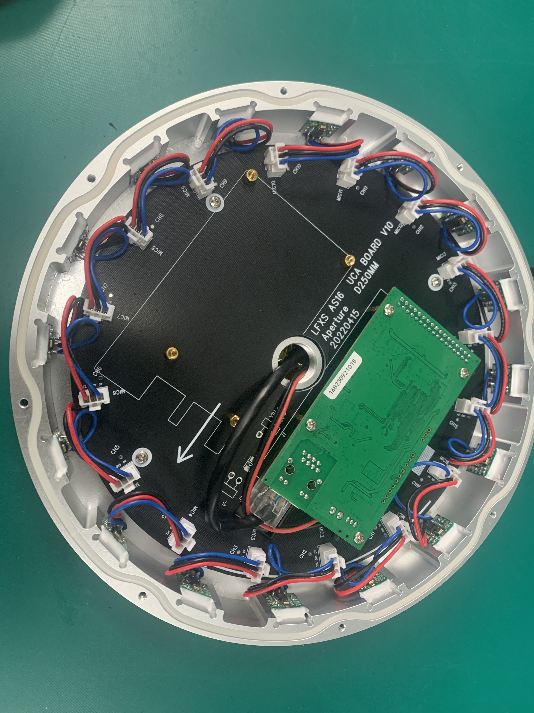

## Context and Objective

This project aimed to build a distributed acoustic perception system based on a Wireless Acoustic Sensor Network (WASN) for complex outdoor environments.  
The objective was to jointly localize and classify sound events with strong robustness against interference and deployment variability.

This project originated from my PhD research topic and has so far produced 3 journal papers and 1 patent.

<figure style="margin:1rem 0 0 0;">
  
  <figcaption style="font-size:0.9rem; opacity:0.85;">Figure 1. System-level architecture of distributed sensing nodes and central fusion.</figcaption>
</figure>

## My Contributions

- Designed the distributed sensing architecture, covering edge acquisition, synchronization, and feature-extraction pathways  
- Completed development and integration of the embedded data-acquisition and signal-processing pipeline  
- Built multimodal SELD learning models for joint sound event classification (SEC) and source localization (SSL)  
- Organized real-world field evaluations and comparative failure-case analysis against conventional localization baselines

## Technical Approach

### 1) Edge Hardware and Time Synchronization

I developed array nodes around **STM32F4 + AD7606**, using **DMA double buffering** for continuous audio acquisition.  
To support distributed localization, I implemented cross-node timestamp alignment with **GPS PPS**.  
I also deployed edge-side feature extraction (SoundMap and GTGram) to reduce transmission load and central compute pressure.

  <figure style="flex:1; min-width:260px; margin:0;">
    
    <figcaption style="font-size:0.9rem; opacity:0.85;">Figure 2. Hardware dataflow from microphone array to edge processing and network output.</figcaption>
  </figure>
  <figure style="flex:1; min-width:260px; margin:0;">
    
    <figcaption style="font-size:0.9rem; opacity:0.85;">Figure 3. Distributed timestamping and PPS-based synchronization.</figcaption>
  </figure>

### 2) Multimodal SELD Learning Architecture

I designed a multimodal architecture that fuses frequency, temporal, and spatial cues.  
The model combines CNN-based representation learning, Transformer-style attention, and a multitask objective for joint SEC/SSL optimization.

<figure style="margin:1rem 0 0 0;">
  
  <figcaption style="font-size:0.9rem; opacity:0.85;">Figure 4. Multimodal SELD model with parallel encoders and joint SEC/SSL learning.</figcaption>
</figure>

## Deployment and Validation

The system was evaluated under practical outdoor interference rather than only controlled benchmark conditions.

### Interference-Robust Localization Case

In a five-node setup, the target class was **Siren**, while **Dog Bark** near node A5 acted as strong interference.

Under this interference condition, classical methods showed significant localization bias, with maximum errors of **22.1 m** (PLSE) and **13.3 m** (FUZZY). In contrast, the proposed method maintained a localization error of **3.7 m** under the same setup, demonstrating stronger robustness to nearby high-intensity interference.

<figure style="margin:1rem 0 0 0;">
  
  <figcaption style="font-size:0.9rem; opacity:0.85;">Figure 5. Comparative failure case under strong nearby interference, highlighting robustness.</figcaption>
</figure>

  <figure style="flex:1; min-width:260px; margin:0;">
    
    <figcaption style="font-size:0.9rem; opacity:0.85;">Figure 6. Indoor validation scene T11.</figcaption>
  </figure>
  <figure style="flex:1; min-width:260px; margin:0;">
    
    <figcaption style="font-size:0.9rem; opacity:0.85;">Figure 7. Indoor validation scene T21.</figcaption>
  </figure>

## Field Deployment Gallery

  <figure style="flex:1; min-width:260px; margin:0;">
    
    <figcaption style="font-size:0.9rem; opacity:0.85;">Figure 8. On-site setup and validation context.</figcaption>
  </figure>
  <figure style="flex:1; min-width:260px; margin:0;">
    
    <figcaption style="font-size:0.9rem; opacity:0.85;">Figure 9. Real-world sensing environment and node placement.</figcaption>
  </figure>
  <figure style="flex:1; min-width:260px; margin:0;">
    
    <figcaption style="font-size:0.9rem; opacity:0.85;">Figure 10. Internal structure and physical state of the microphone array.</figcaption>
  </figure>

## Selected Publications and Patent

- [Sound Event Localization and Classification using Wireless Acoustic Sensor Networks in Outdoor Environments](https://ieeexplore.ieee.org/document/11192195)
- [Multiple sound sources localization using sub-band spatial features and attention mechanism](https://link.springer.com/article/10.1007/s00034-024-02925-6)
- [Synthesis-to-real robust training for enhanced sound event localization and detection using dynamic kernel convolution networks](https://www.sciencedirect.com/science/article/abs/pii/S0003682X24004183)
- [Air sonar array device for acousto-optic linkage monitoring and positioning (CN218003722U)](https://patents.google.com/patent/CN218003722U/en?oq=CN218003722U)
