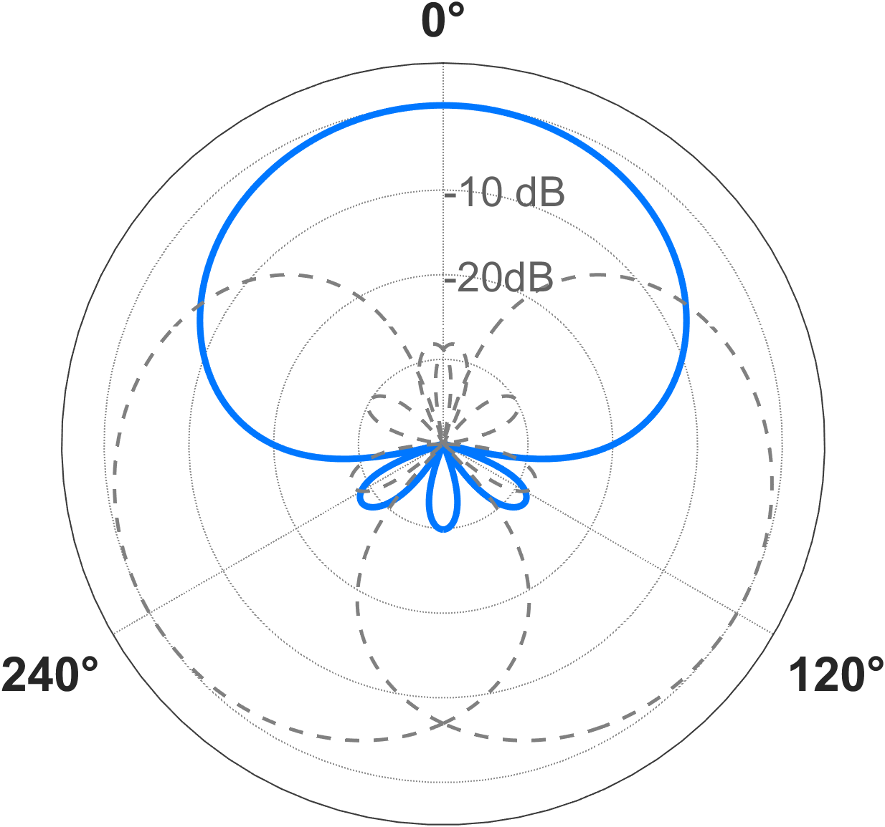
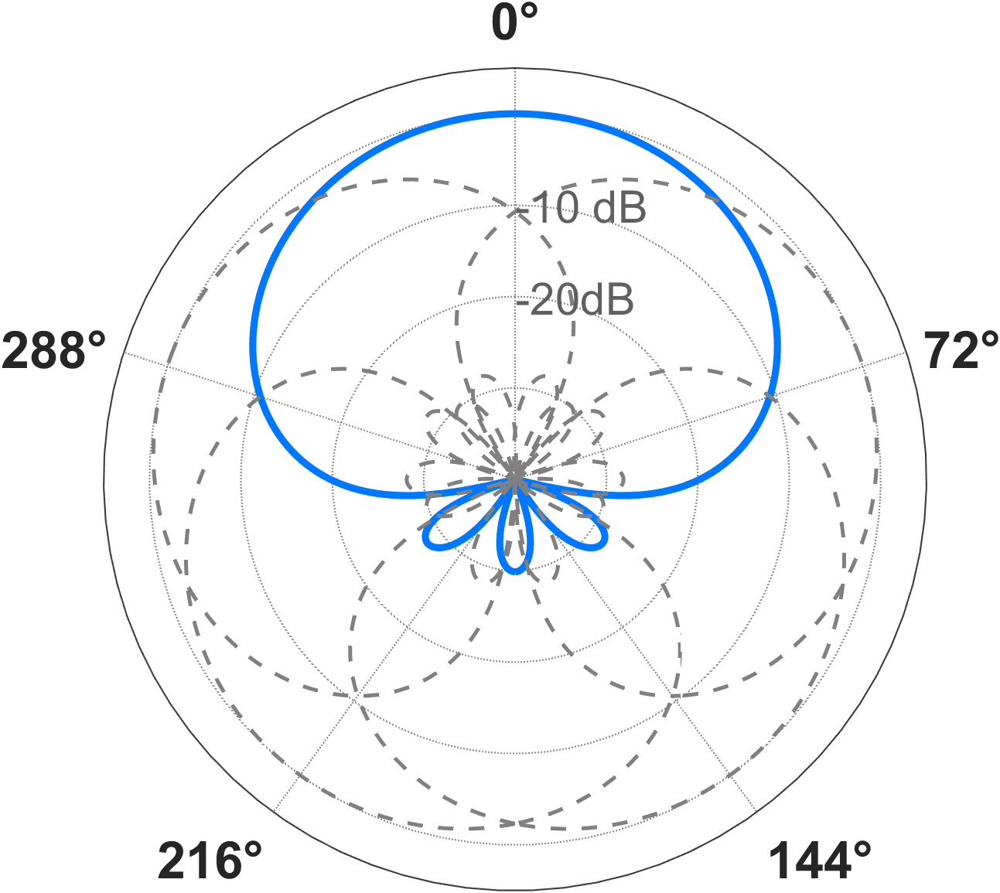

## Context and Objective

Most multichannel speech enhancement models are strongly coupled to microphone geometries seen during training.  
This project addresses that bottleneck by developing a geometry-agnostic framework that generalizes across array layouts while remaining computationally efficient.  
This project has produced two papers accepted by **ICASSP 2026**.

## My Contributions

- Built a beampattern-driven Spatial Filter Bank (SFB) design workflow for principled channel selection  
- Developed an Eigenbeam-domain representation for geometry-agnostic feature extraction  
- Proposed an efficient architecture that replaces heavy attention modules with lightweight recurrent modeling

## Technical Approach

### 1) Spatial Filter Bank (SFB) Design

For arbitrary planar arrays, we first build geometry-aware steering vectors in the STFT domain, then use modal matching to map a predefined target beampattern into implementable spatial filters.  
In practice, each steered filter is solved using a minimum-norm solution (equivalent to maximizing White Noise Gain, WNG), and multiple steering directions are combined to form the SFB.  
This process linearly projects geometry-dependent microphone signals into a fixed-dimensional channel space, providing a geometry-agnostic representation for the back-end network.

### 2) SFB Channel Number Optimization Principle

The key conclusion is that the SFB channel number I should not be chosen empirically, but derived from beampattern spatial coverage characteristics.  
If I is too small, spatial coverage gaps appear; if I is too large, angular oversampling leads to highly correlated adjacent channels and redundant features.  
Therefore, we constrain the adjacent main-lobe interval 2pi/I to lie within the effective range defined by BW-3dB and BW-6dB, balancing complete coverage and minimal redundancy.  
Under the second-order supercardioid and first-order hypercardioid settings reported in the paper, the optimal channel count concentrates around 3 and is validated by ablation studies.

### 3) Efficient SFB-LSTM Enhancement Architecture

After front-end redundancy is reduced, the back-end no longer needs high-complexity MHSA modules for effective feature modeling.  
We therefore replace the Conformer-style heavy attention path with a lightweight dual-LSTM design: one block models temporal dependencies, and the other models frequency dependencies, together with an encoder-decoder reconstruction pipeline.  
The resulting SFB-LSTM system maintains comparable or better enhancement quality under randomized array conditions while significantly reducing GFLOPS, making it more suitable for edge deployment.

## Results and Validation

Under fully randomized planar array settings, the method matched or exceeded strong baselines on **PESQ** and **STOI**, while reducing **GFLOPS by 25%-33.7%**.  
These results indicate improved portability to heterogeneous edge devices with limited compute budgets.

## System Architecture

*Figure 1. SFB-LSTM pipeline: arbitrary array inputs are transformed into geometry-invariant features and enhanced with a lightweight recurrent model.*

## Spatial Coverage Analysis

  
  

*Figure 2. The 3-channel configuration (left) provides efficient spatial coverage, while the 5-channel setting (right) introduces oversampling and feature redundancy.*

