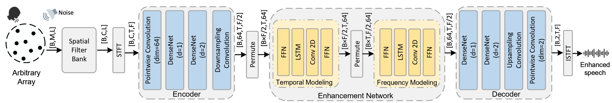
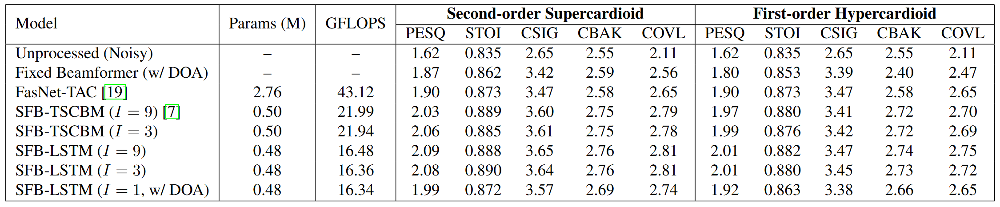
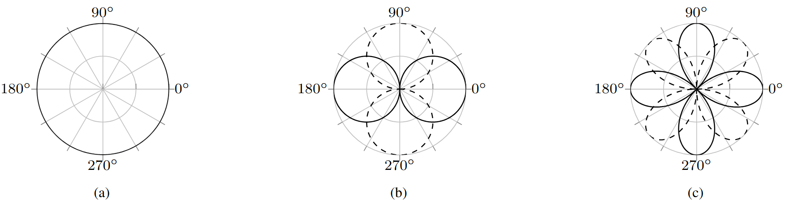
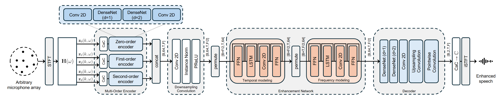
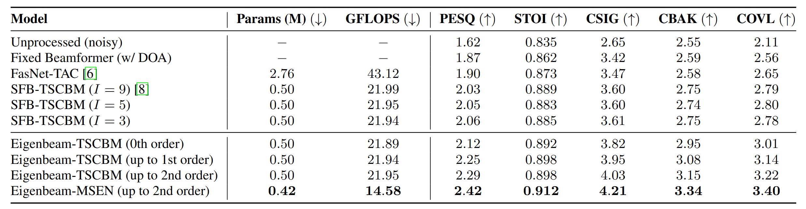

**Accepted to ICASSP 2026** · *Politecnico di Milano & Northwestern Polytechnical University*

## Context & The Core Bottleneck
Most multichannel speech enhancement models share a common vulnerability: their performance is tightly coupled to the specific microphone array geometry used during training. When deployed on unseen devices with different microphone layouts, their performance degrades significantly. 

While **Geometry-Agnostic** methods (like Spatial Filter Banks, SFB) solve the hardware dependency by projecting array signals onto fixed channels, they introduce a new problem: **Computational Bloat**. Existing methods often rely on empirically chosen, high-dimensional features paired with heavy self-attention back-ends (e.g., Conformers). This creates a massive computational bottleneck, preventing real-time deployment on resource-constrained edge devices.

To address this, I have developed two distinct, physics-informed frameworks that progressively eliminate feature redundancy and slash computational cost by up to **33.7%**. 

---

## Evolution I: Taming the Spatial Filter Bank (SFB-LSTM)
**The Insight: Stop guessing channel numbers. Calculate the exact spatial coverage limit.**

In traditional SFB designs, the number of channels ($I$) is typically chosen based on intuition, leading to massive feature redundancy. My first approach establishes a theoretical foundation to calculate the precise optimal channel count required for complete spatial coverage without oversampling.

### 1. Theoretical Grounding for Spatial Coverage
A frequency-independent beampattern is characterized by its core sensitive region ($BW_{-3dB}$) and its effective coverage area ($BW_{-6dB}$). To ensure seamless spatial coverage while minimizing inter-channel redundancy, we mathematically constrain the angular separation between adjacent beams ($\frac{2\pi}{I}$) to fall strictly within this effective range:

$$\frac{2\pi}{BW_{-6dB}} < I < \frac{2\pi}{BW_{-3dB}}$$

This principle proves that for a second-order supercardioid beam, **only 3 channels are optimal**, drastically reducing the dimensionality compared to empirical 9-channel designs.

<figure style="margin:1rem 0 0 0;">
  
  <figcaption style="font-size:0.9rem; opacity:0.85;">
    Table 1. Theoretical derivation of optimal channel counts for various common beampatterns.
  </figcaption>
</figure>

### 2. Visualizing Redundancy
The theoretical derivation is strongly supported by spatial coverage analysis. As shown below, the 3-channel configuration provides efficient coverage, whereas increasing to 5 channels introduces severe angular oversampling and highly correlated, redundant features.

  

    
    
<em>Fig. 2(a). Optimal coverage ($I=3$)</em>

  

  

    
    
<em>Fig. 2(b). Redundant oversampling ($I=5$)</em>

  

### 3. Architecture & Impact
By completely stripping away spatial redundancy at the front-end, the back-end network no longer requires computationally expensive Multi-Head Self-Attention (MHSA) modules. We replaced the heavy Conformer blocks with a lightweight dual-LSTM design. 

*Fig. 3. End-to-end SFB-LSTM architecture used in the first ICASSP 2026 paper.*

As the results demonstrate, this SFB-LSTM architecture maintains the enhancement quality of the Conformer-based baseline while **reducing computational load (GFLOPS) by 25.6%**.

*Table 2. Results (Evolution I): The 3-channel SFB-LSTM matches the 9-channel baseline's performance while being significantly lighter.*

---

## Evolution II: The Orthogonal Breakthrough (Eigenbeam-MSEN)
**The Insight: Directional beams overlap. Orthogonal modes don't.**

While Evolution I optimizes directional beams to their theoretical limit, adjacent beams still physically overlap. To fundamentally eliminate spatial redundancy, my second approach shifts from the directional domain to the modal domain, utilizing perfectly orthogonal spatial bases.

### 1. Eigenbeam Spatial Basis
We proposed an Eigenbeam front-end that uses modal matching to project multi-channel signals from an arbitrary planar array into a canonical, geometry-invariant space spanned by orthogonal **Circular Harmonics (CH)**. The target beampattern for the $p$-order, $q$-mode eigenbeam is mathematically formulated as:

$$\mathcal{B}(b_{2N}^{(p,q)},\theta) = \sum_{n=-N}^{N} b_{n}^{(p,q)} e^{jn\theta}$$

This yields orthogonal modes (0th-order omnidirectional, 1st-order dipoles, 2nd-order quadrupoles) that inherently contain zero spatial overlap.

*Fig. 4. Visualization of 0th, 1st, and 2nd-order Eigenbeam spatial bases. These orthogonal modes extract geometry-agnostic features without spatial redundancy.*

### 2. Multi-Order Spatial Encoder Network (MSEN)
Standard neural networks process all feature channels identically. However, Eigenbeam features of different orders contain distinct physical properties. To leverage this strong inductive bias, we designed the **Multi-order Spatial Encoder Network (MSEN)**. 

As shown in the framework below, MSEN employs **parallel encoding pathways** to process the 0th, 1st, and 2nd-order eigenbeam features separately before fusing them in a late-fusion module.

*Fig. 5. Eigenbeam-MSEN architecture with multi-order encoders and order-aware enhancement network (second ICASSP 2026 paper).*

### 3. Architecture & Impact
This architecture represents a paradigm shift in both performance and efficiency. Evaluated on fully randomized planar arrays, the Eigenbeam-MSEN achieves state-of-the-art speech enhancement quality (PESQ: 2.42, STOI: 0.912) while further **reducing computational complexity by 33.7%** compared to the strongest baselines.

*Table 3. Results (Evolution II): Eigenbeam-MSEN significantly outperforms SOTA methods across all metrics with the lowest GFLOPS.*

---

## Summary
By intimately coupling acoustic signal processing theory with neural network design, these two ICASSP 2026 works demonstrate that **Geometry-Agnostic Speech Enhancement does not have to be computationally expensive.** Whether through theoretically bounded spatial filters or inherently orthogonal eigenbeams, we can unlock high-fidelity multi-channel audio for the next generation of edge AI devices.

> **Note:** Preprints and open-source code for these papers will be available soon. Please feel free to contact me for early discussions on these architectures.
